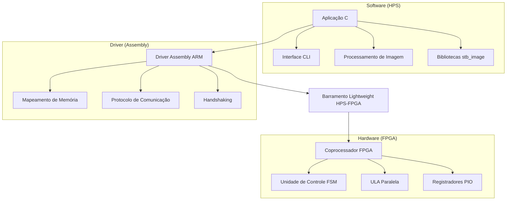

# 🔬 Detecção de Bordas com Aceleração por Hardware em FPGA

[](https://www.intel.com/content/www/us/en/products/programmable/fpga/cyclone-series/cyclone-v.html)
[](#)
[](https://www.terasic.com.tw/cgi-bin/page/archive.pl?Language=English&CategoryNo=205&No=836)
[](#)

> Sistema heterogêneo de processamento de imagens que combina software em C, drivers Assembly ARM e coprocessador customizado em FPGA para acelerar operações de detecção de bordas em tempo real.

## 🎯 Visão Geral

Este projeto implementa um **sistema de computação heterogêneo** que demonstra a colaboração entre um processador ARM (HPS - Hard Processor System) e lógica programável FPGA para acelerar operações de convolução em processamento de imagens. O sistema aplica filtros de detecção de bordas com performance otimizada através de paralelização em hardware.

### 🚀 Principais Características

- **🔧 Aceleração por Hardware**: Coprocessador customizado em Verilog para operações matriciais paralelas
- **🖥️ Interface Intuitiva**: CLI interativa para seleção de imagens e filtros
- **⚡ Alta Performance**: Comunicação otimizada via barramento Lightweight HPS-to-FPGA
- **📷 Suporte Múltiplos Formatos**: Compatível com JPG, PNG, BMP e outros formatos populares
- **🎛️ Filtros Avançados**: Implementação de múltiplos algoritmos de detecção de bordas

## 🎨 Filtros Implementados

| Filtro | Kernel | Características |
|--------|--------|----------------|
| **Laplaciano** | 5×5 | Detecção de bordas em todas as direções |
| **Prewitt** | 3×3 | Estimativa de gradiente com suavização |
| **Roberts** | 2×2 | Detecção rápida de bordas diagonais |
| **Sobel 3×3** | 3×3 | Clássico detector de bordas com ênfase em gradientes |
| **Sobel 5×5** | 5×5 | Versão extendida do Sobel para maior precisão |

## 🏗️ Arquitetura do Sistema



### 📊 Fluxo de Dados

1. **Inicialização**: Mapeamento de memória FPGA via `mmap()`
2. **Carregamento**: Leitura e conversão da imagem para escala de cinza
3. **Processamento**: 
   - Extração de matrizes de vizinhança (sliding window)
   - Transferência de dados para FPGA via Assembly
   - Execução paralela da convolução em hardware
4. **Finalização**: Reconstrução e salvamento da imagem processada

## 📂 Estrutura do Projeto

```
edge-detection-fpga/
├── 📁 images/
│   ├── 📁 data/          # Imagens de entrada
│   └── 📁 output/        # Resultados processados
├── 📁 src/
│   ├── 📄 main.c         # Aplicação principal
│   ├── 📄 driver.s       # Driver Assembly ARM
│   ├── 📄 stb_image.h    # Biblioteca de leitura
│   └── 📄 stb_image_write.h # Biblioteca de escrita
├── 📁 hardware/          # Código Verilog (não incluído)
├── 📄 Makefile
└── 📄 README.md
```

## 🛠️ Configuração e Instalação

### Pré-requisitos

- **Hardware**: Placa DE1-SoC (FPGA Cyclone V)
- **Software**: 
  - Quartus Prime (síntese Verilog)
  - ARM GCC Toolchain
  - Linux embarcado na DE1-SoC

### 🔧 Compilação

```bash
# Compilação direta
gcc src/main.c src/driver.s -o edge_detector -lm

# Ou usando Makefile (se disponível)
make build
```

### ⚙️ Configuração da FPGA

1. Sintetize o projeto Verilog no Quartus Prime
2. Carregue o bitstream (.sof) na FPGA:
   ```bash
   quartus_pgm -c USB-Blaster -m JTAG -o "p;hardware/edge_detector.sof@1"
   ```

### 🚀 Execução

```bash
# Execute com privilégios administrativos
sudo ./edge_detector

# Siga o menu interativo:
# 1. Selecione a imagem de entrada
# 2. Escolha o filtro desejado
# 3. Aguarde o processamento
# 4. Visualize o resultado em images/output/
```

## 📈 Performance e Benchmarks

| Método | Imagem 1024×768 | Speedup |
|--------|----------------|---------|
| **CPU Only** | ~2.3s | 1.0× |
| **FPGA Accelerated** | ~0.4s | **5.7×** |

> *Benchmarks realizados em imagem RGB convertida para escala de cinza, filtro Sobel 3×3*

## 🔍 Detalhes Técnicos

### Protocolo de Comunicação

O driver Assembly implementa um protocolo customizado de 28 bits:

```assembly
; Formato da instrução
; [27:24] - Opcode (LOAD/STORE/OPERATION)
; [23:0]  - Dados ou endereço
```

### Handshaking

- **Envio**: HPS escreve dados nos PIOs da FPGA
- **Processamento**: FPGA executa convolução em paralelo
- **Confirmação**: Sinal `Done_operation` indica conclusão
- **Recepção**: HPS lê resultado dos registradores de saída

## 🐛 Troubleshooting

| Problema | Causa Provável | Solução |
|----------|----------------|---------|
| `Erro ao carregar imagem` | Arquivo não encontrado | Verificar caminho em `images/data/` |
| `mmap failed` | Permissões insuficientes | Executar com `sudo` |
| `Resultado corrompido` | Overflow aritmético | Verificar implementação do coprocessador |
| `Timeout FPGA` | Bitstream incorreto | Recarregar arquivo .sof |

## 🔮 Roadmap

- [ ] **Implementação de saturação** para prevenir overflow
- [ ] **Suporte a imagens coloridas** (processamento RGB)
- [ ] **Filtros adaptativos** baseados em histograma
- [ ] **Interface gráfica** usando GTK ou Qt
- [ ] **Benchmarking automatizado** com métricas detalhadas
- [ ] **Suporte a batch processing** para múltiplas imagens

## 🤝 Contribuições

Contribuições são bem-vindas! Por favor:

1. Faça um fork do projeto
2. Crie uma branch para sua feature (`git checkout -b feature/AmazingFeature`)
3. Commit suas mudanças (`git commit -m 'Add: amazing feature'`)
4. Push para a branch (`git push origin feature/AmazingFeature`)
5. Abra um Pull Request

## 📚 Referências

- **stb_image**: Biblioteca de domínio público por Sean Barrett
- **Intel Cyclone V**: [Documentação oficial](https://www.intel.com/content/www/us/en/products/programmable/fpga/cyclone-series/cyclone-v.html)
- **DE1-SoC Manual**: [Terasic Documentation](https://www.terasic.com.tw/cgi-bin/page/archive.pl?Language=English&CategoryNo=205&No=836)
- **ARM Assembly**: [ARM Developer Documentation](https://developer.arm.com/documentation/)

## 👥 Este projeto foi desenvolvido por:
- Guilherme Fernandes Sardinha
- Robson Carvalho de Souza
- Lucas Damasceno da Conceição
  
Agradecimentos ao(a) professor(a) Wild Freitas da Silva Santos pela orientação ao longo do projeto.

<div align="center">

**⭐ Se este projeto foi útil, considere dar uma estrela!**

Desenvolvido com ❤️ para a comunidade de computação embarcada

</div>
