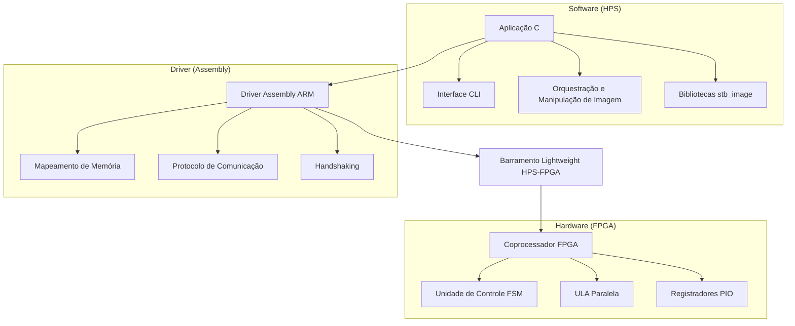

# 🔬 Detecção de Bordas com Aceleração por Hardware em FPGA

[](https://www.intel.com/content/www/us/en/products/programmable/fpga/cyclone-series/cyclone-v.html)
[](#)
[](https://www.terasic.com.tw/cgi-bin/page/archive.pl?Language=English&CategoryNo=205&No=836)
[](#)

## 📑 Sumário
- [🌟 Introdução](#-introdução)
- [🎯 Objetivos e Requisitos](#-objetivos-e-requisitos)
- [🛠️ Recursos Utilizados](#️-recursos-utilizados)
- [📖 Metodologia](#-metodologia)
- [🏗️ Arquitetura do Sistema](#️-arquitetura-do-sistema)
- [📂 Estrutura do Projeto](#-estrutura-do-projeto)
- [🚀 Como Executar](#-como-executar)
- [📊 Resultados e Análise](#-resultados-e-análise)
- [🐛 Troubleshooting](#-troubleshooting)
- [💡 Melhorias e Trabalhos Futuros](#-melhorias-e-trabalhos-futuros)
- [📚 Referências](#-referências)
- [✍️ Colaboradores](#️-colaboradores)

---

## 🌟 Introdução

Este projeto implementa um **sistema de computação heterogêneo** que demonstra a colaboração entre um processador ARM (HPS - Hard Processor System) e lógica programável (FPGA) para acelerar operações de convolução em processamento de imagens. O sistema aplica diversos filtros de detecção de bordas com performance otimizada através de um coprocessador customizado em Verilog, que executa as operações matriciais de forma paralela.

A comunicação entre o software (aplicação em C) e o hardware (FPGA) é gerenciada por uma **biblioteca de baixo nível em Assembly ARM**, que abstrai as complexidades do acesso aos registradores e do protocolo de handshaking, permitindo que a aplicação principal se concentre na orquestração do fluxo de dados e na interação com o usuário.

---

## 🎯 Objetivos e Requisitos

O objetivo principal deste trabalho é desenvolver e validar um sistema capaz de acelerar algoritmos de detecção de bordas, utilizando a sinergia entre software e hardware disponível na plataforma DE1-SoC.

### 📋 Requisitos do Projeto

1.  **Aceleração por Hardware**: Implementar um coprocessador em Verilog na FPGA para executar operações de convolução 2D.
2.  **Comunicação HPS-FPGA**: Desenvolver uma biblioteca em Assembly ARM para gerenciar a transferência de dados e o controle de operações entre o processador e o coprocessador.
3.  **Aplicação de Alto Nível**: Criar uma aplicação em C com uma interface de linha de comando (CLI) para carregar imagens, selecionar filtros e salvar os resultados.
4.  **Implementação de Filtros**: Suportar múltiplos algoritmos de detecção de bordas, incluindo Laplaciano, Prewitt, Roberts e Sobel.
5.  **Compatibilidade de Formatos**: Utilizar a biblioteca `stb_image` para garantir a leitura de formatos de imagem populares (JPG, PNG, etc.).

---

## 🛠️ Recursos Utilizados

- **Hardware**: Placa DE1-SoC (FPGA Cyclone V) para a implementação do coprocessador e execução do sistema embarcado.
- **Quartus Prime**: Ferramenta da Intel utilizada para a síntese, compilação e programação do código Verilog na FPGA.
- **ARM GCC Toolchain**: Compilador para gerar o executável a partir dos códigos-fonte em C (`main.c`) e Assembly (`driver.s`).
- **Linguagens**:
    - **C**: Para a lógica da aplicação principal, interface com o usuário e manipulação de arquivos de imagem.
    - **Assembly ARM**: Para a biblioteca de driver de baixo nível que gerencia a comunicação com a FPGA.
    - **Verilog**: Para a descrição de hardware do coprocessador matricial (não incluído no repositório).
- **Bibliotecas Externas**:
    - **stb_image.h / stb_image_write.h**: Bibliotecas de domínio público para leitura e escrita de múltiplos formatos de imagem.

---

## 📖 Metodologia

O processo de detecção de bordas foi dividido em etapas de software e hardware, com uma metodologia clara para a comunicação e processamento dos dados.

### O que são Filtros de Detecção de Borda?
Detectores de borda são algoritmos fundamentais em processamento de imagem, projetados para identificar pontos onde a intensidade da luminosidade de uma imagem muda abruptamente. Essas descontinuidades geralmente correspondem aos contornos de objetos. A técnica mais comum para implementar esses filtros é a **convolução**, uma operação matemática que aplica um pequeno kernel (matriz) sobre a imagem para calcular novos valores para cada pixel, realçando características específicas, como as bordas.

### Descrição dos Filtros Implementados
| Filtro | Kernel | Características |
| :--- | :--- | :--- |
| **Laplaciano** | 5×5 | É um filtro de segunda derivada que detecta bordas em todas as direções. Por ser muito sensível a ruído, é ideal para imagens com boa qualidade e produz bordas bem definidas. |
| **Prewitt** | 3×3 | Utiliza dois kernels para estimar o gradiente da imagem nas direções horizontal e vertical. É bom para detectar bordas e oferece um efeito de suavização que reduz o ruído. |
| **Roberts** | 2×2 | Um dos primeiros e mais simples detectores de borda. Usa dois kernels 2x2 para encontrar bordas diagonais. É computacionalmente rápido, mas mais sensível a ruído. |
| **Sobel 3×3** | 3×3 | Semelhante ao Prewitt, mas dá mais peso aos pixels centrais, resultando em uma melhor aproximação do gradiente e maior robustez a ruído. É um dos filtros mais utilizados no processamento de imagens. |
| **Sobel 5×5** | 5x5 | Uma versão estendida do filtro Sobel que considera uma vizinhança maior. Teoricamente, oferece maior precisão, mas sua implementação apresentou resultados incorretos neste projeto. |

### Fluxo de Processamento de Imagem
O fluxo de dados do sistema foi projetado para otimizar a interação entre o software e o hardware.

1.  **Carregamento e Pré-processamento**: A aplicação em C carrega a imagem do disco usando a biblioteca `stb_image` e a converte para escala de cinza. Isso simplifica a operação de convolução para um único canal de cor.
2.  **Mapeamento de Memória**: Antes de iniciar o processamento, a função `mmap_setup()` do driver Assembly é chamada para mapear os endereços dos registradores da FPGA na memória virtual do HPS.
3.  **Orquestração em Janela Deslizante**: O software em C itera sobre cada pixel da imagem (exceto as bordas) e extrai uma submatriz (janela) de vizinhos. O tamanho dessa janela corresponde ao kernel do filtro selecionado (ex: 3x3, 5x5).
4.  **Chamada ao Driver**: Para cada pixel, a matriz de vizinhança e o kernel do filtro são passados para a função `driver` em Assembly.
5.  **Convolução em Hardware**: O driver Assembly transfere os dados para o coprocessador na FPGA, que realiza a operação de convolução em paralelo. O processo de convolução em hardware foi projetado para realizar múltiplas operações de multiplicação-acumulação simultaneamente, acelerando significativamente o cálculo.
6.  **Leitura do Resultado**: Após o hardware sinalizar a conclusão da operação (handshake), o driver lê o resultado e o retorna para a aplicação em C.
7.  **Reconstrução da Imagem**: O valor resultante é inserido na imagem de saída. Ao final do processo, a imagem processada é salva em disco.

---

## 🏗️ Arquitetura do Sistema

A arquitetura do sistema é dividida em três camadas principais: a aplicação de alto nível, o driver de baixo nível e o hardware customizado.



# Comunicação e Handshake

## Protocolo de Comunicação
O driver Assembly implementa um protocolo customizado de 28 bits para enviar dados e comandos para a FPGA.

### Snippet de código

```assembly
; Formato da instrução
; - Opcode (LOAD/STORE/OPERATION)
; [23:0]  - Dados ou endereço
```

## Handshaking
O fluxo de controle é gerenciado por um protocolo de handshaking simples:

- O HPS escreve os dados e aciona um sinal Start.
- O coprocessador na FPGA inicia o processamento.
- Ao finalizar, a FPGA aciona um sinal Done_operation.
- O HPS detecta o sinal de Done, lê o resultado e reinicia o ciclo.

# 📂 Estrutura do Projeto

```
edge-detection-fpga/
├── 📁 images/
│   ├── 📁 data/          # Imagens de entrada
│   └── 📁 output/        # Resultados processados
├── 📁 src/
│   ├── 📄 main.c         # Aplicação principal
│   ├── 📄 driver.s       # Driver Assembly ARM
│   ├── 📄 stb_image.h    # Biblioteca de leitura
│   └── 📄 stb_image_write.h # Biblioteca de escrita
├── 📄 Makefile
└── 📄 README.md
```

**Nota:** O código-fonte em Verilog do coprocessador (hardware/) não está incluído neste repositório.

# 🚀 Como Executar

## Pré-requisitos

**Hardware:** Placa DE1-SoC (FPGA Cyclone V)

**Software:**
- Quartus Prime
- ARM GCC Toolchain
- Linux embarcado na DE1-SoC

## Compilação

```bash
# Compilação usando o Makefile (recomendado)
make build

# Ou compilação manual
gcc src/main.c src/driver.s -o edge_detector -lm
```

## Configuração da FPGA

1. Sintetize o projeto Verilog no Quartus Prime.
2. Carregue o bitstream (.sof) na FPGA:

```bash
quartus_pgm -c USB-Blaster -m JTAG -o "p;path/to/your_project.sof@1"
```

## Execução

```bash
# Execute o programa com privilégios de administrador
sudo ./edge_detector

# Siga o menu interativo:
# 1. Escolha a opção para iniciar o programa.
# 2. Digite o nome da imagem de entrada (ex: lena.png).
# 3. Escolha o filtro desejado.
# 4. Aguarde o processamento. O resultado será salvo em images/output/.
```

# 📊 Resultados e Análise

Os testes qualitativos com os filtros implementados apresentaram os seguintes resultados:

- **Filtro Laplaciano:** Apresentou, de longe, o melhor resultado, com bordas muito bem definidas e nítidas.
- **Filtros Roberts e Prewitt:** Ambos produziram resultados de boa qualidade, com uma detecção de bordas clara e eficaz.
- **Filtro Sobel 3x3:** Gerou um resultado aceitável, mas com bordas menos proeminentes em comparação com os outros filtros.
- **Filtro Sobel 5x5:** A implementação deste filtro resultou em uma imagem incorreta, sugerindo possíveis problemas de overflow aritmético ou na lógica de convolução para kernels maiores.

# 🐛 Troubleshooting

| Problema | Causa Provável | Solução |
|----------|----------------|---------|
| Erro ao carregar imagem | Arquivo não encontrado ou formato inválido. | Verificar se o nome do arquivo está correto e se ele está localizado na pasta images/data/. |
| mmap failed | Permissões insuficientes para acessar /dev/mem. | Executar o programa com sudo. |

# 💡 Melhorias e Trabalhos Futuros

Com base nos resultados obtidos, as seguintes melhorias são propostas para trabalhos futuros:

- **Melhorar o tratamento de overflow:** Implementar lógica de saturação no coprocessador Verilog para garantir que os valores de pixel resultantes da convolução permaneçam no intervalo de 8 bits (0-255), evitando artefatos visuais.
- **Refinar a operação de convolução em Verilog:** Depurar e otimizar o módulo de convolução, especialmente para kernels maiores (como 5x5), para garantir a precisão dos cálculos e corrigir os resultados incorretos observados.

# 📚 Referências

- **stb_image:** Biblioteca de domínio público por Sean Barrett.
- **Intel Cyclone V:** Documentação oficial
- **DE1-SoC Manual:** Terasic Documentation
- **ARM Assembly:** ARM Developer Documentation

# ✍️ Colaboradores

- Guilherme Fernandes Sardinha
- Robson Carvalho de Souza
- Lucas Damasceno da Conceição

Agradecimentos ao professor Wild Freitas da Silva Santos pela orientação ao longo do projeto.

<div align="center">

⭐ Se este projeto foi útil, considere dar uma estrela!

Desenvolvido com ❤️ para a comunidade de computação embarcada

</div>
